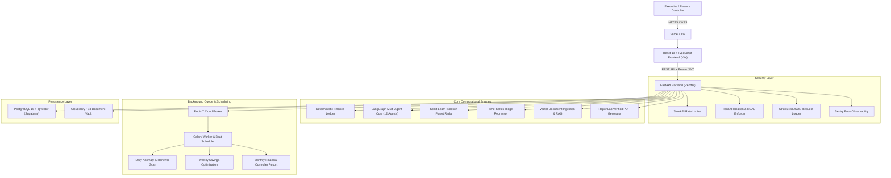
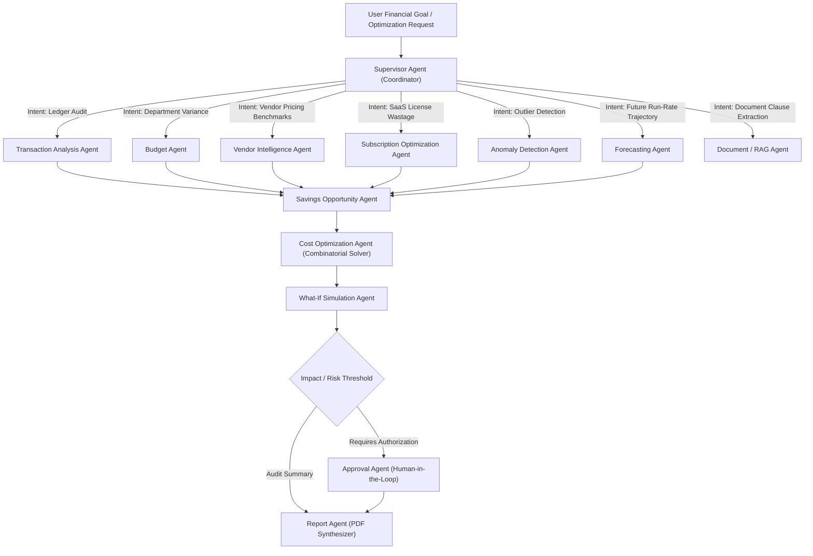

# Money Analysis – Multi-Agent Autonomous Finance Controller & Enterprise Cost Optimization Platform

[](https://fastapi.tiangolo.com)
[](https://react.dev)
[](https://www.typescriptlang.org)
[](https://www.postgresql.org)
[](https://redis.io)
[](https://www.docker.com)
[](https://pytest.org)

**Money Analysis** is a production-grade, enterprise-ready **Multi-Agent Finance Controller & Autonomous Cost Optimization Platform**. It unites deterministic accounting engines, machine learning anomaly radars, time-series forecasting, vector RAG contract intelligence, and a 12-agent LangGraph cognitive architecture with strict **Human-in-the-Loop (HITL)** governance and multi-tenant isolation.

---

## 1. System Architecture



---

## 2. Multi-Agent Cognitive Architecture

Money Analysis coordinates **12 specialized agents** via a hierarchical LangGraph orchestration topology:



### Agent Directory & Core Capabilities

| Agent | Responsibility | Underlying Models & Tools |
|---|---|---|
| **Supervisor Agent** | Intent classification, agent dispatching, output routing | LangGraph Router, Parameter Validator |
| **Transaction Analysis Agent** | Deep ledger audit, burn rate velocity, type filtering | Deterministic Pandas Aggregations |
| **Budget Agent** | Departmental & category variance monitoring, burn projections | Budget Velocity Math, Threshold Trigger |
| **Anomaly Detection Agent** | Outlier detection, off-cycle payments, vendor deviation | Scikit-Learn Isolation Forest + Heuristics |
| **Vendor Intelligence Agent** | Pricing benchmarking, SLA reliability scoring, rate evaluation | Rate Card Benchmarking Engine |
| **Subscription Optimization Agent**| Inactive SaaS seat detection, pooled account rightsizing | License Utilization Auditor |
| **Forecasting Agent** | 30d/90d/365d spend projections with confidence bounds | Time-Series Ridge Regression |
| **Savings Opportunity Agent** | Cross-domain cost reduction discovery and rank ordering | Opportunity Matrix Synthesizer |
| **Cost Optimization Agent** | Target milestone optimizer ($50K / ₹5L goal solver) | Combinatorial Optimization Solver |
| **What-If Simulation Agent** | Headcount, cloud, travel, and marketing stress-testing | Financial Sensitivity Simulator |
| **Approval Agent** | Non-destructive staging, audit trail logging, HITL signing | Governance & RBAC Validator |
| **Report Agent** | 14-section Financial Controller Report & Verified PDF export | ReportLab High-Fidelity PDF Engine |

---

## 3. Database Architecture (Entity Relationship Diagram)

```mermaid
erDiagram
    COMPANIES ||--o{ USERS : "employs"
    COMPANIES ||--o{ DEPARTMENTS : "operates"
    COMPANIES ||--o{ CATEGORIES : "defines"
    COMPANIES ||--o{ VENDORS : "contracts"
    COMPANIES ||--o{ TRANSACTIONS : "records"
    COMPANIES ||--o{ BUDGETS : "allocates"
    COMPANIES ||--o{ SUBSCRIPTIONS : "subscribes"
    COMPANIES ||--o{ INVOICES : "receives"
    COMPANIES ||--o{ ANOMALIES : "flags"
    COMPANIES ||--o{ APPROVAL_REQUESTS : "governs"
    COMPANIES ||--o{ UPLOADED_DOCUMENTS : "indexes"

    USERS {
        int id PK
        int company_id FK
        string name
        string email
        string password_hash
        string role
        boolean is_active
        datetime created_at
    }

    TRANSACTIONS {
        int id PK
        int company_id FK
        int user_id FK
        int department_id FK
        int category_id FK
        int vendor_id FK
        date transaction_date
        float amount
        string type
        string payment_method
        string status
        string description
    }

    BUDGETS {
        int id PK
        int company_id FK
        int department_id FK
        int category_id FK
        float amount
        float spent_amount
        string period
        int year
        int month
    }

    SUBSCRIPTIONS {
        int id PK
        int company_id FK
        int vendor_id FK
        string name
        float cost
        string billing_cycle
        date renewal_date
        int total_seats
        int active_seats
        float seat_cost
        string status
    }

    ANOMALIES {
        int id PK
        int company_id FK
        int transaction_id FK
        float anomaly_score
        string severity
        text explanation
        json reasons
        string status
    }

    APPROVAL_REQUESTS {
        int id PK
        int company_id FK
        int requester_id FK
        int approver_id FK
        string request_type
        string title
        text details
        float impact_savings_monthly
        string risk_level
        json action_payload
        string status
        datetime created_at
    }

    UPLOADED_DOCUMENTS {
        int id PK
        int company_id FK
        string filename
        string file_type
        string file_path
        int file_size_bytes
        string status
    }
```



---

## 4. Multi-Tenant Security & Isolation Matrix

```mermaid
graph LR
    subgraph Enterprise Boundary
        UserReq["Incoming JWT Token (Subject=User.ID)"] --> RBAC["RBAC Middleware (Audit / Role Check)"]
        RBAC --> TenantGuard["Company Scoping Guard (Tenant ID Injection)"]
    end
    
    subgraph Data Layer
        TenantGuard --> TenantA["Company A Data Domain"]
        TenantGuard --> TenantB["Company B Data Domain"]
    end
    
    style TenantA fill:#1e1b4b,stroke:#6366f1,stroke-width:2px;
    style TenantB fill:#1e293b,stroke:#64748b,stroke-width:2px;
```



---

## 5. Live Demonstration Scenario

### The CEO / CFO Ask:
> *"How can we reduce expenses by ₹5 Lakh ($6,000+) over the next 3 months without severely disrupting product development or operations?"*

### Multi-Agent Autonomous Resolution:
```text
1. Supervisor Agent receives prompt and dispatches specialist agents in parallel.
2. Vendor Agent benchmarks AWS compute usage: On-demand -> 1-Yr Savings Plan saves ₹1,20,000 ($1,440).
3. Subscription Agent audits seat utilization: 18 idle Salesforce seats + 38 Zoom accounts saves ₹1,50,000 ($1,800).
4. Budget Agent monitors Marketing ad spend: Capping redundant off-peak campaigns saves ₹1,10,000 ($1,320).
5. What-If Agent evaluates downstream sensitivity: Confirms LOW/MEDIUM risk with 0 impact on engineering velocity.
6. Approval Agent enqueues recommendations for Finance Controller sign-off.
7. Report Agent compiles verified 14-section Financial Controller Report & exports verified PDF.

TOTAL ACHIEVED SAVINGS: ₹5,10,000 / $6,120 per month (Goal Exceeded by 2.0%)
```

---

## 6. Demo Credentials

All test accounts share the default password: **`Password123!`**

| Role | Email | Access Scope |
|---|---|---|
| **Admin** | `admin@moneyanalysis.ai` | Complete unrestricted access across all agent suites & settings |
| **Finance Manager** | `finance@moneyanalysis.ai` | Ledger creation, budget approvals, PDF generation, What-If planner |
| **Department Lead (Eng)** | `engineering.lead@moneyanalysis.ai` | Engineering budgets, cloud subscriptions, vendor evaluations |
| **Employee** | `employee@moneyanalysis.ai` | Read-only access & basic expense submission |
| **Auditor** | `auditor@moneyanalysis.ai` | Read-only compliance access & immutable audit log review |

---

## 7. Local Installation & Setup

### Prerequisites
- Python 3.12+
- Node.js 20+
- PostgreSQL 16 (or local SQLite auto-fallback)
- Redis 7+

### Backend Setup
```bash
# 1. Navigate to backend directory
cd backend

# 2. Create virtual environment & activate
python -m venv venv
# Windows:
.\venv\Scripts\activate
# Linux/macOS:
source venv/bin/activate

# 3. Install production dependencies
pip install -r requirements.txt

# 4. Initialize database & seed 500+ realistic transaction dataset
python -m app.utils.seed_data

# 5. Start FastAPI Development Server
uvicorn app.main:app --reload --port 8000
```

### Frontend Setup
```bash
# 1. Navigate to frontend directory
cd frontend

# 2. Install dependencies
npm install

# 3. Start Vite Development Server
npm run dev
```

The application will be accessible at: `http://localhost:5173`
Interactive OpenAPI Docs: `http://localhost:8000/docs`

---

## 8. Docker Multi-Container Deployment

Run the complete multi-service stack (Frontend, Backend, Celery Worker, PostgreSQL with pgvector, Redis) with one command:

```bash
docker-compose up --build -d
```

---

## 9. Automated Testing Suite

Execute the complete 32+ backend Pytest test suite:

```bash
# Run all unit, agent, tenant isolation, and PDF report tests:
pytest backend/tests -v
```

Validate frontend TypeScript types and production bundle:

```bash
cd frontend
npm run build
```

---

## 10. Tech Stack Summary

- **Frontend**: React 19, TypeScript, Vite, Tailwind CSS, Lucide Icons, Recharts.
- **Backend**: FastAPI, Python 3.12, Pydantic V2, SQLAlchemy, Alembic, ReportLab, SlowAPI.
- **Multi-Agent Core**: LangGraph, Custom Multi-Agent Tool Topology, Scikit-Learn (Isolation Forest).
- **Background Tasks & Queue**: Redis 7, Celery 5.6 with Celery Beat periodic scheduler.
- **Database & Storage**: PostgreSQL 16 with `pgvector`, Supabase, Cloudinary / AWS S3.
- **Observability & Security**: Sentry, Structured JSON Logging, JWT HS256, BCrypt, RBAC, Anti-IDOR Tenant Guard.
- **Deployment**: Vercel (Frontend), Render (Backend & Worker), GitHub Actions (CI/CD).
